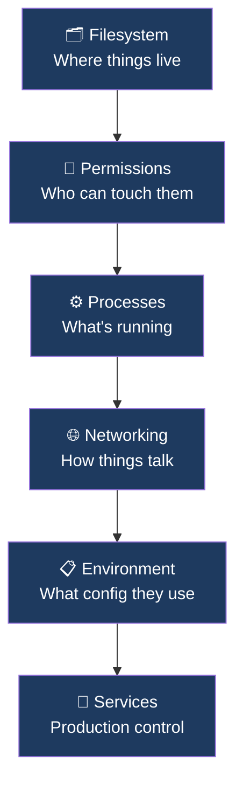
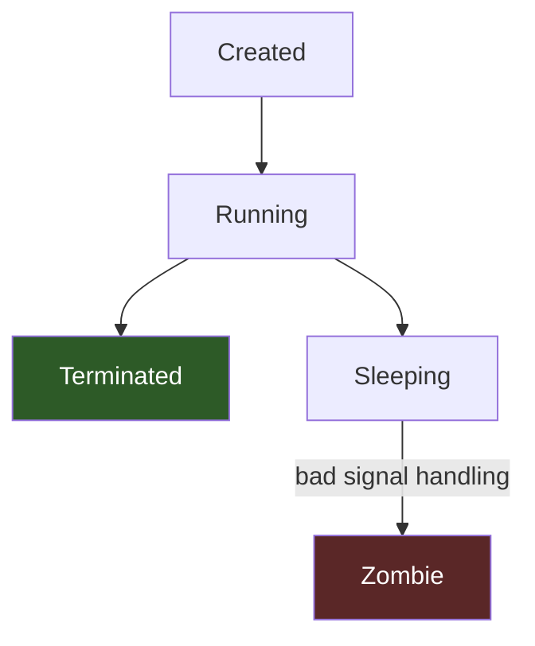
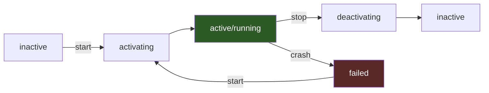
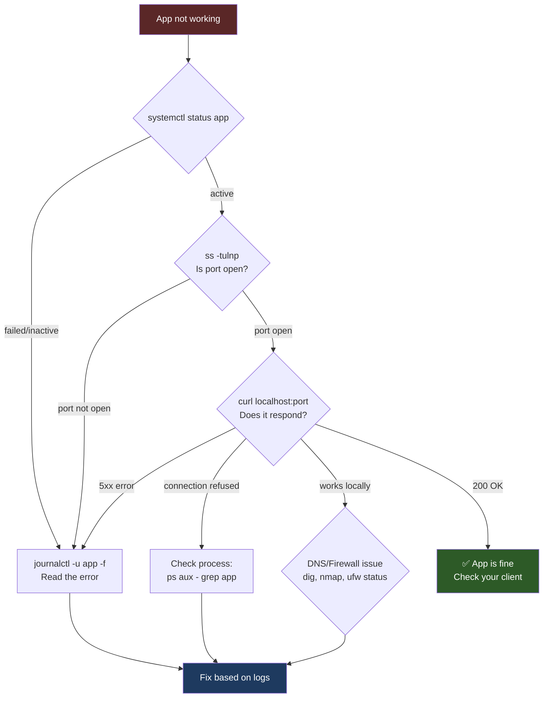

# DevOps Linux Cheat Sheet


## 🗺️ The Mental Model

>  **How to use this**: Don't read it top to bottom. Use it as a reference. The debugging flow at the bottom is the most important thing here.




---

## 📁 1. Filesystem + Permissions

### Permission Model

```
 rwx  r-x  r--
 │    │    └── others (world)
 │    └─────── group
 └──────────── user (owner)
```

|Octal|Binary|Meaning|
|---|---|---|
|`7`|`111`|`rwx`|
|`6`|`110`|`rw-`|
|`5`|`101`|`r-x`|
|`4`|`100`|`r--`|
|`0`|`000`|`---`|

### Core Commands

```bash
ls -lah               # list with permissions, human sizes, hidden files
chmod 755 file        # rwxr-xr-x
chmod -R 750 /app     # recursive
chown user:group file
chown -R appuser:app /app
```

### Key Rules

> [!important] Directory vs File
> 
> - **Files** need `r` to read, `w` to write
> - **Directories** need `x` to enter (cd into)
> - Access requires permissions on **every parent directory**

```bash
# Typical production pattern
chown -R appuser:app /app
chmod -R 750 /app        # owner=rwx, group=r-x, others=none
```

### Other Permission Tools

```bash
groups                    # what groups your user is in
umask                     # view default permission mask
umask 022                 # new files = 644, dirs = 755
chmod g+s /shared-dir     # setgid: new files inherit group
```

> [!warning] Never do `chmod 777` You've just removed all security. Every user, every process can read, write, and execute. This is always wrong in production.

---

## ⚙️ 2. Processes

### Process States



### View Processes

```bash
ps aux                    # all processes, full detail
ps aux | grep appname     # filter for specific app
top                       # live view, press q to quit
htop                      # better top (if installed)
```

### Kill Processes

```bash
kill PID          # SIGTERM (15) — graceful, app can clean up
kill -9 PID       # SIGKILL — force kill, no cleanup
killall appname   # kill by name
```

### Signal Reference

|Signal|Number|Meaning|
|---|---|---|
|`SIGTERM`|15|Graceful stop — try this first|
|`SIGKILL`|9|Force kill — no cleanup|
|`SIGINT`|2|Ctrl+C|
|`SIGHUP`|1|Reload config (nginx, etc.)|

### Background Jobs

```bash
sleep 100 &       # run in background
jobs              # list background jobs
fg                # bring last job to foreground
fg %2             # bring job #2 to foreground
bg                # resume stopped job in background
nohup python app.py &   # survive terminal close (use systemd instead in production)
```

> [!tip] Use systemd in production `nohup` is for quick hacks. If you're running a real service, use `systemctl` (see Section 6).

---

## 🌐 3. Networking

### Debugging Flow


### Connectivity

```bash
ping google.com           # basic reachability
traceroute google.com     # hop-by-hop path
```

### Ports & Listening Services

```bash
ss -tuln          # listening ports (no process names)
ss -tulnp         # listening ports WITH process names (use this)
```

**Reading `ss` output:**

```
Netid  State   Local Address:Port
tcp    LISTEN  0.0.0.0:8080        ← all interfaces, port 8080
tcp    LISTEN  127.0.0.1:5432      ← localhost only (postgres)
tcp    LISTEN  :::80               ← all IPv6 interfaces
```

### HTTP / API Testing

```bash
curl -I https://example.com              # headers only
curl -v https://example.com              # verbose (debug TLS etc.)
curl -X POST -d '{"key":"val"}' \
     -H "Content-Type: application/json" \
     http://localhost:8080/api
curl -o /dev/null -s -w "%{http_code}" url  # just the status code
```

### DNS Resolution

```bash
dig google.com            # full DNS lookup
dig google.com +short     # just the IP
nslookup google.com       # alternative
cat /etc/hosts            # local overrides (check here first!)
cat /etc/resolv.conf      # which DNS servers are configured
```

> [!tip] DNS is usually the problem Before assuming your app is broken, check: does the hostname resolve? `dig yourdomain.com`. Many "networking issues" are just broken DNS.

### Port Scanning

```bash
nmap localhost            # scan local ports
nmap -p 8080 hostname     # check specific port on remote host
```

---

## 📂 4. I/O Redirection & File Descriptors

> This is everywhere in log pipelines, scripts, and debugging. Not optional.

### The Three Streams

```
stdin  (0) ← keyboard / pipe input
stdout (1) → terminal / file output
stderr (2) → error output (separate from stdout)
```

### Redirection

```bash
command > file.txt          # stdout → file (overwrite)
command >> file.txt         # stdout → file (append)
command 2> error.txt        # stderr → file
command 2>&1                # merge stderr into stdout
command > all.txt 2>&1      # stdout + stderr → file
command 2>/dev/null         # suppress errors
command > /dev/null 2>&1    # suppress everything
```

### Pipes

```bash
ps aux | grep nginx         # pipe stdout of ps into grep
cat file | sort | uniq      # chain commands
command | tee file.txt      # write to file AND show on screen
```

---

## 🔍 5. grep / awk / sed (Log Parsing Essentials)

> You will use these daily. Learn them.

### grep — Search

```bash
grep "error" app.log                  # find lines with "error"
grep -i "error" app.log               # case insensitive
grep -n "error" app.log               # show line numbers
grep -r "TODO" ./src                  # recursive search in directory
grep -v "debug" app.log               # exclude lines matching
grep -A 3 "error" app.log             # show 3 lines AFTER match
grep -B 3 "error" app.log             # show 3 lines BEFORE match
grep -E "error|warn" app.log          # regex OR
```

### awk — Column Extraction

```bash
awk '{print $1}' file          # print first column
awk '{print $1, $3}' file      # print columns 1 and 3
awk -F: '{print $1}' /etc/passwd   # use : as delimiter
awk '/error/ {print $0}' file  # print lines matching pattern

# Real example: get PIDs from ps
ps aux | awk '{print $2}'
```

### sed — Find & Replace

```bash
sed 's/old/new/' file             # replace first occurrence per line
sed 's/old/new/g' file            # replace all occurrences
sed -i 's/old/new/g' file         # in-place edit (modifies file)
sed -n '10,20p' file              # print lines 10–20
sed '/pattern/d' file             # delete lines matching pattern
```

### Real-world combo

```bash
# Count errors per minute from a log
grep "ERROR" app.log | awk '{print $1, $2}' | sort | uniq -c
```

---

## ⏰ 6. Cron (Scheduled Jobs)

### Cron Syntax

```
* * * * * command
│ │ │ │ │
│ │ │ │ └── Day of week (0–7, 0=Sunday)
│ │ │ └──── Month (1–12)
│ │ └────── Day of month (1–31)
│ └──────── Hour (0–23)
└────────── Minute (0–59)
```

### Examples

```bash
0 * * * *        # every hour at :00
*/15 * * * *     # every 15 minutes
0 2 * * *        # daily at 2:00 AM
0 2 * * 0        # weekly Sunday at 2 AM
0 0 1 * *        # monthly on 1st at midnight
```

### Managing Crontabs

```bash
crontab -e        # edit your crontab
crontab -l        # list your crontabs
crontab -r        # remove all (careful!)
sudo crontab -e   # edit root's crontab
```

### Good Practices

```bash
# Always redirect output or it emails you (annoying)
0 2 * * * /path/to/script.sh >> /var/log/myjob.log 2>&1

# Use absolute paths — cron has minimal $PATH
0 2 * * * /usr/bin/python3 /home/user/script.py
```

> [!warning] Cron doesn't have your environment Your `~/.bashrc` doesn't load in cron. Always use absolute paths and set env vars explicitly in the crontab or script.

---

## 🔑 7. SSH

### Basic Usage

```bash
ssh user@hostname              # connect
ssh -p 2222 user@hostname      # non-default port
ssh -i ~/.ssh/mykey user@host  # specific key
```

### Key-Based Auth Setup

```bash
# Generate a key pair (do this once)
ssh-keygen -t ed25519 -C "your@email.com"

# Copy public key to server
ssh-copy-id user@hostname
# or manually:
cat ~/.ssh/id_ed25519.pub >> ~/.ssh/authorized_keys  # on server
```

### File Transfer

```bash
scp file.txt user@host:/path/        # copy file to server
scp user@host:/path/file.txt .       # copy file from server
scp -r dir/ user@host:/path/         # copy directory
rsync -avz ./local/ user@host:/path/ # sync (better than scp for dirs)
```

### Port Forwarding

```bash
# Local: access remote service locally
ssh -L 8080:localhost:5432 user@host
# Now: localhost:8080 → host:5432 (postgres on remote)

# Remote: expose local port on remote server
ssh -R 9090:localhost:8080 user@host
```

### SSH Config (saves typing)

```bash
# ~/.ssh/config
Host myserver
    HostName 192.168.1.100
    User ubuntu
    Port 2222
    IdentityFile ~/.ssh/mykey

# Now just:
ssh myserver
```

---

## 🌿 8. Environment Variables

### Basics

```bash
echo $HOME              # print a variable
echo $PATH              # where shell looks for commands
env                     # list all env vars
printenv VAR_NAME       # print specific var

export MY_VAR="value"   # set for current session + child processes
MY_VAR="value" command  # set only for this one command
```

### Persistence

```bash
# Add to ~/.bashrc (user shell sessions)
echo 'export MY_VAR="value"' >> ~/.bashrc
source ~/.bashrc         # reload without restarting terminal

# System-wide
/etc/environment         # simple KEY=VALUE, no export needed
/etc/profile.d/*.sh      # scripts loaded at login
```

### .env Files

```bash
# .env file format
DB_HOST=localhost
DB_PORT=5432
DB_PASS=secret

# Load in bash
set -a; source .env; set +a

# Pass to docker
docker run --env-file .env myapp
```

### In systemd services

```ini
[Service]
Environment="DB_HOST=localhost"
EnvironmentFile=/etc/myapp/.env
```

> [!important] Never commit `.env` files Add `.env` to `.gitignore`. Always. This is how credentials get leaked.

---

## 💾 9. Disk & Memory

> You WILL hit "disk full" or "out of memory" in production. Know these cold.

### Disk

```bash
df -h                   # disk usage per filesystem (human-readable)
df -h /                 # just root partition
du -sh /var/log         # size of a directory
du -sh * | sort -rh     # size of all items, sorted largest first
du -sh * | sort -rh | head -10   # top 10 largest
```

### Finding What's Eating Disk

```bash
du -sh /var/* | sort -rh | head    # what's in /var?
du -sh /var/log/* | sort -rh       # drilling into logs
find / -size +500M 2>/dev/null     # files larger than 500MB
```

### Memory

```bash
free -h                 # RAM + swap (human-readable)
free -m                 # in megabytes
```

**Reading `free` output:**

```
              total    used    free    shared   available
Mem:           15Gi    8.2Gi   2.1Gi   512Mi     6.5Gi
Swap:          2.0Gi   0B      2.0Gi
```

> [!tip] Use `available`, not `free` `free` = completely unused RAM. `available` = what the OS can actually give to a new process (includes reclaimable cache). Always look at `available`.

```bash
# Top memory consumers
ps aux --sort=-%mem | head -10

# Top CPU consumers
ps aux --sort=-%cpu | head -10
```

---

## 📦 10. tar & Compression

```bash
# Create archives
tar -czf archive.tar.gz  dir/      # gzip compressed
tar -cjf archive.tar.bz2 dir/      # bzip2 compressed
tar -cf  archive.tar     dir/       # no compression

# Extract
tar -xzf archive.tar.gz            # extract gzip
tar -xjf archive.tar.bz2           # extract bzip2
tar -xf  archive.tar               # extract uncompressed

# List contents without extracting
tar -tzf archive.tar.gz

# Extract to specific location
tar -xzf archive.tar.gz -C /target/dir/
```

**Memory trick for tar flags:**

```
c = create
x = extract
z = gzip (.gz)
j = bzip2 (.bz2)
f = file (always last, before filename)
v = verbose (see what's happening)
```

---

## 📝 11. Bash Scripting

### Template (always start with this)

```bash
#!/bin/bash
set -euo pipefail   # e=exit on error, u=error on undefined var, o pipefail=pipe failures

SCRIPT_DIR="$(cd "$(dirname "${BASH_SOURCE[0]}")" && pwd)"
```

### Variables

```bash
name="test"
echo "$name"          # always quote variables
echo "${name}_suffix" # use braces when needed
```

### Conditionals

```bash
if [ "$name" = "test" ]; then
    echo "match"
elif [ "$name" = "other" ]; then
    echo "other"
else
    echo "no match"
fi

# File checks
[ -f file ]    # file exists
[ -d dir ]     # directory exists
[ -z "$var" ]  # variable is empty
[ -n "$var" ]  # variable is not empty
```

### Loops

```bash
for i in 1 2 3; do echo "$i"; done

for file in *.log; do
    echo "Processing $file"
done

while read -r line; do
    echo "$line"
done < input.txt
```

### Functions

```bash
greet() {
    local name="$1"    # local = scoped to function
    echo "Hello, $name"
}
greet "Nishanth"
```

### Exit Codes

```bash
command
echo $?         # 0 = success, anything else = failure

command || echo "command failed"     # run on failure
command && echo "command succeeded"  # run on success
```

---

## 🔄 12. systemd (Production Service Control)

### Service Lifecycle



### Core Commands

```bash
systemctl start app
systemctl stop app
systemctl restart app
systemctl reload app        # reload config without restart (if supported)
systemctl status app        # current state + recent logs
```

### Boot Persistence

```bash
systemctl enable app        # start at boot
systemctl disable app       # don't start at boot
systemctl is-enabled app    # check if enabled
```

### Logs

```bash
journalctl -u app           # all logs for service
journalctl -u app -f        # follow (live tail)
journalctl -u app -n 100    # last 100 lines
journalctl -u app --since "1 hour ago"
journalctl -u app --since "2024-01-01" --until "2024-01-02"
```

### Service File Template

```ini
[Unit]
Description=My App
After=network.target       # start after network is up

[Service]
Type=simple
ExecStart=/usr/bin/python3 /app/main.py
WorkingDirectory=/app
User=appuser
Group=app
Restart=always
RestartSec=5               # wait 5s before restarting
Environment=PORT=8080
EnvironmentFile=/app/.env

# Output to journal
StandardOutput=journal
StandardError=journal

[Install]
WantedBy=multi-user.target
```

```bash
# After creating/editing a service file:
systemctl daemon-reload     # always do this first
systemctl enable --now app  # enable + start in one command
```

---

## 🔥 Real-World Debugging Flow

> App not working? Run through this in order. Don't skip steps.



### The 6-Step Checklist

```bash
# 1. Service status
systemctl status app

# 2. Logs (most important step)
journalctl -u app -f

# 3. Process running?
ps aux | grep app

# 4. Port listening?
ss -tulnp | grep 8080

# 5. HTTP responding?
curl -v localhost:8080

# 6. Disk full? Memory?
df -h && free -h

# 7. Permissions?
ls -lah /app/
```

---

## ❌ Common DevOps Mistakes

> [!danger] `chmod 777` Removes all security. Every process on the machine can read, write, execute. Never do this.

> [!danger] Running everything as root One bad command and you've destroyed your system. Use dedicated service users.

> [!warning] Ignoring logs The answer is almost always in the logs. `journalctl -u app -f` before doing anything else.

> [!warning] Not understanding groups Leads to silent permission failures that are painful to debug.

> [!warning] Hardcoded secrets in code Use env vars or secret managers. Never commit `.env` files or passwords.

> [!warning] No `set -euo pipefail` in scripts Without this, your script silently continues after failures.

---

## 🧠 Final Truth

All of DevOps — Docker, Kubernetes, CI/CD, everything — is built on:

```
Filesystem + Permissions + Processes + Networking + Environment
```

